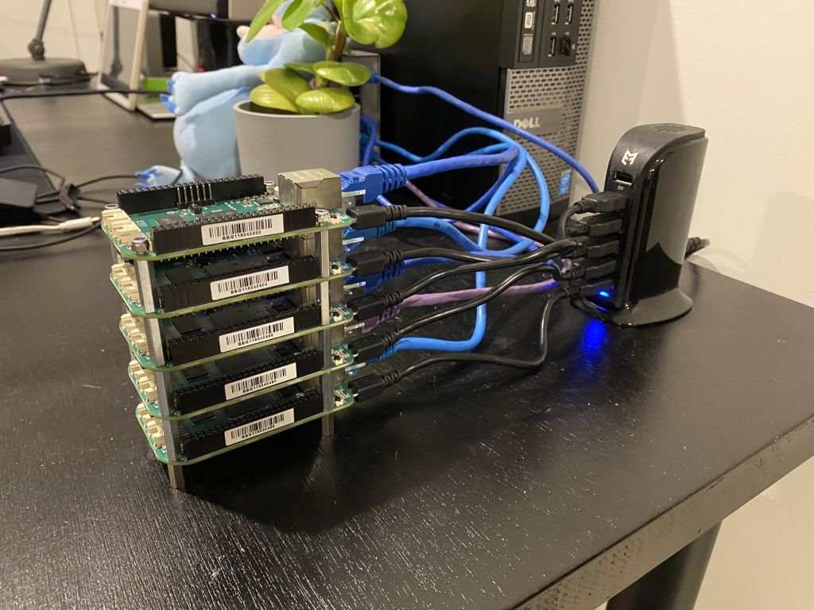

# beagle-pack

## Configure BeagleBone

Updated image to Debian 10.3 using eMMC IoT Flasher from https://beagleboard.org/latest-images

Power up the BeagleBone Green Wireless while holding down the small button near the SD slot. You need to keep it pressed until the blue LEDs start flashing wildly.

### Set static IP address

Connect BBG via USB. Connect to `192.168.7.2`

```
$ connmanctl services
*AR Wired                ethernet_88c2556c93d9_cable
$ sudo connmanctl config ethernet_88c2556c93d9_cable --ipv4 manual 192.168.1.10 255.255.255.0 192.168.1.1
$ sudo connmanctl config ethernet_689e19a7b79c_cable --nameservers 8.8.8.8 4.4.4.4
```

## Configure gpio 113 and 111 as output

See [pinout](https://seeeddoc.github.io/BeagleBone_Green/)

Anode is connected to GPIO_20

Red catode is connected to GPIO_49
Green catode is connected to GPIO_117

By default the GPIOs are configured active low

Set anode high
```
cd /sys/class/gpio/gpio20 && echo out > direction && echo 0 > value
```

Turn led on (both red and green)
```
cd /sys/class/gpio/gpio49 && echo out > direction && echo 1 > value
cd /sys/class/gpio/gpio117 && echo out > direction && echo 1 > value
```

Turn led off (both red and green)
```
cd /sys/class/gpio/gpio49 && echo out > direction && && echo 0 > value
cd /sys/class/gpio/gpio117 && echo out > direction && echo 0 > value
```
